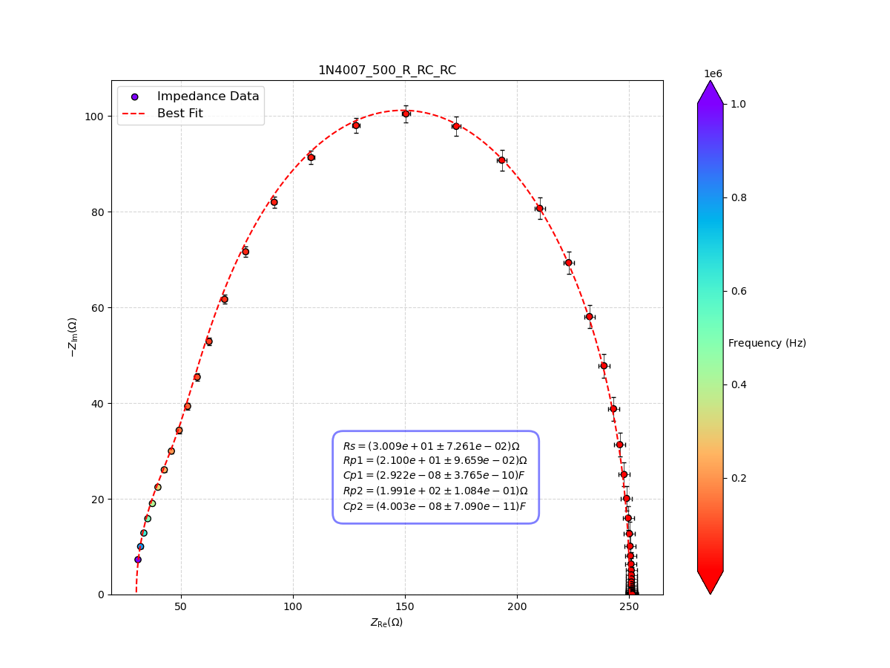

# Impedance Spectroscopy
This repository contains the code for my bachelor thesis work on using impedance spectroscopy to characterize a p-n junction diode.

Using Complex Nonlinear Least Squares (CNLS) fitting, the impedance data is fitted to an equivalent model of the diode. In this case, we are using a model with a *series* resistor `Rs`, and two *parallel* `RC` circuits. Each parameter represents a physical property of the diode.

## Example Results

┌─────────────────────────────────────────────────────────────────────────┐
│                                Migrad                                   │
├──────────────────────────────────┬──────────────────────────────────────┤
│ FCN = 491.1 (χ²/ndof = 4.5)      │              Nfcn = 350              │
│ EDM = 3.48e-05 (Goal: 0.0002)    │                                      │
├──────────────────────────────────┼──────────────────────────────────────┤
│          Valid Minimum           │   Below EDM threshold (goal x 10)    │
├──────────────────────────────────┼──────────────────────────────────────┤
│      No parameters at limit      │           Below call limit           │
├──────────────────────────────────┼──────────────────────────────────────┤
│             Hesse ok             │         Covariance accurate          │
└──────────────────────────────────┴──────────────────────────────────────┘
┌───┬──────┬───────────┬───────────┬────────────┬────────────┬─────────┬─────────┬───────┐
│   │ Name │   Value   │ Hesse Err │ Minos Err- │ Minos Err+ │ Limit-  │ Limit+  │ Fixed │
├───┼──────┼───────────┼───────────┼────────────┼────────────┼─────────┼─────────┼───────┤
│ 0 │ Rs   │   30.09   │   0.07    │            │            │    0    │         │       │
│ 1 │ Rp1  │   21.0    │    0.1    │            │            │    0    │         │       │
│ 2 │ Cp1  │  29.2e-9  │  0.4e-9   │            │            │    0    │         │       │
│ 3 │ Rp2  │  199.13   │   0.11    │            │            │    0    │         │       │
│ 4 │ Cp2  │ 40.03e-9  │  0.07e-9  │            │            │    0    │         │       │
└───┴──────┴───────────┴───────────┴────────────┴────────────┴─────────┴─────────┴───────┘
┌─────┬──────────────────────────────────────────────────────────────────────────────────────┐
│     │               Rs              Rp1              Cp1              Rp2              Cp2 │
├─────┼──────────────────────────────────────────────────────────────────────────────────────┤
│  Rs │          0.00527            0.002  23.67461875e-12           -0.006  2.969984534e-12 │
│ Rp1 │            0.002          0.00933   4.89857649e-12           -0.007  5.746666402e-12 │
│ Cp1 │  23.67461875e-12   4.89857649e-12         1.42e-19 -24.34833093e-12           11e-21 │
│ Rp2 │           -0.006           -0.007 -24.34833093e-12           0.0118 -4.440994157e-12 │
│ Cp2 │  2.969984534e-12  5.746666402e-12           11e-21 -4.440994157e-12         5.03e-21 │
└─────┴──────────────────────────────────────────────────────────────────────────────────────┘
