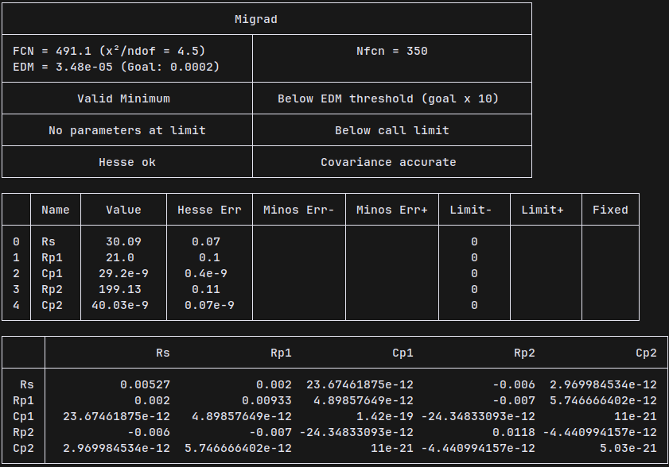

# Impedance Spectroscopy
This repository contains the code for my bachelor thesis work on using impedance spectroscopy to characterize a p-n junction diode.

Using Complex Nonlinear Least Squares (CNLS) fitting, the impedance data is fitted to an equivalent model of the diode. In this case, we are using a model with a *series* resistor `Rs`, and two *parallel* `RC` circuits. Each parameter represents a physical property of the diode.

## Example Results

